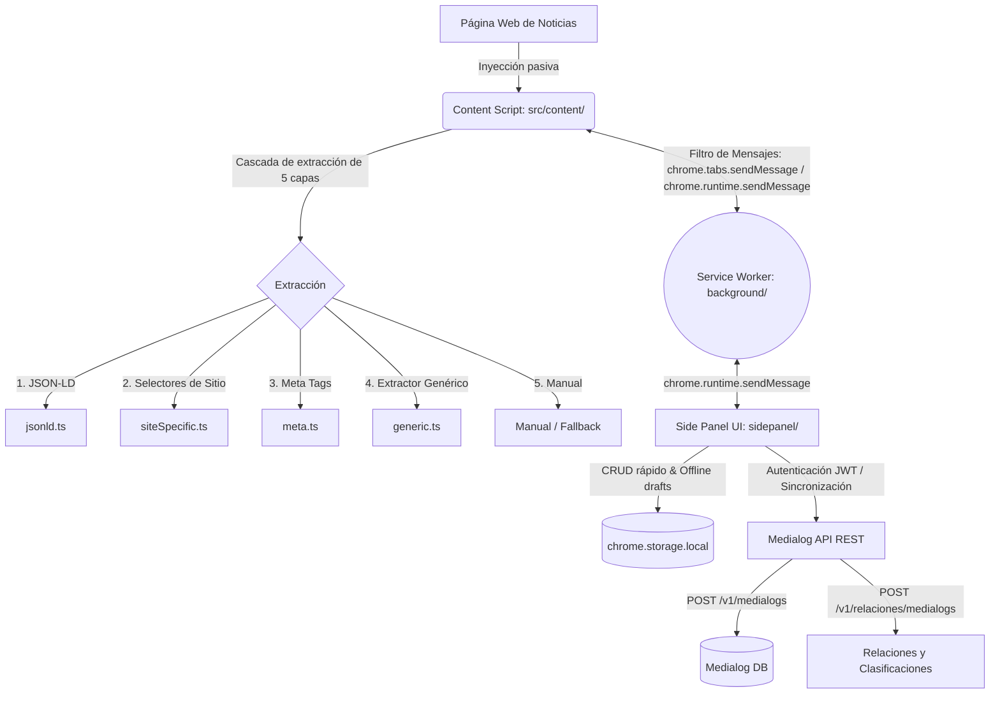

# 📰 PortalScrapper

**PortalScrapper** es una extensión de navegador moderna para Google Chrome y Microsoft Edge (desarrollada bajo el estándar **Manifest V3**) diseñada para la captura pasiva, silenciosa y de alta calidad de artículos de prensa desde los principales portales de noticias de internet, integrando una **persistencia directa** en la base de datos de **Medialog** a través de su API REST.

La extensión monitorea de forma inteligente el navegador, extrae automáticamente el contenido estructurado del artículo web activo, resuelve automáticamente metadatos clave (emisora, portal, emisión), y permite al usuario revisar y enriquecer los datos desde un **Side Panel** persistente antes de sincronizarlos de forma definitiva.

---

## 🗺️ Arquitectura del Sistema

La extensión está estructurada bajo la arquitectura modular de las extensiones modernas de Chrome, separando las responsabilidades de UI, mensajería en segundo plano y ejecución en páginas de terceros:



### 🧱 Componentes Principales

1. **Content Scripts (`src/content/index.ts`)**: 
   Inyectados en todas las pestañas de noticias soportadas. Detectan si el usuario se encuentra en un artículo válido, ejecutan la cascada de extracción y transmiten los datos estructurados al Service Worker. Utilizan un `MutationObserver` con control de rebote (debounce) para tolerar actualizaciones dinámicas en Single Page Applications (SPAs).
   
2. **Service Worker (`src/background/service-worker.ts`)**: 
   Actúa como el broker de mensajería central de la extensión. Coordina las solicitudes entre el Content Script y la UI del Side Panel, gestiona actualizaciones del badge en el icono de la extensión y actúa como respaldo local en segundo plano.

3. **Side Panel UI (`src/sidepanel/`)**: 
   Interfaz de usuario persistente y fluida que se aloja al costado de la pantalla. Cuenta con un flujo de inicio de sesión con JWT, un formulario de revisión exhaustivo, visualización de clasificaciones automáticas y panel de historial de drafts guardados localmente.

4. **API Client (`src/api/`)**:
   - `client.ts`: Expone las llamadas REST a la API de Medialog (`/v1/medialogs/`, `/v1/portales/`, `/v1/relaciones/medialogs/`, `/v1/emisiones/`).
   - `auth.ts`: Maneja el ciclo de vida del token JWT en `chrome.storage.local`, incluyendo auto-expiración.
   - `types.ts`: Define de forma estricta los payloads de envío y recepción.

5. **Extractors Cascade (`src/extractors/`)**:
   Implementa una lógica en cascada de 5 capas ordenada por nivel de confianza técnica:
   - **Capa 1: JSON-LD (`jsonld.ts`)** (0.95): Extrae metadatos estandarizados de `<script type="application/ld+json">`. Es la fuente más robusta y confiable.
   - **Capa 2: Selectores Específicos (`siteSpecific.ts`)** (0.85): Lógica curada con selectores CSS específicos por portal registrado. Ahora procesa selectores de manera secuencial ordenada por prioridad para evitar falsos positivos de fallbacks genéricos.
   - **Capa 3: Meta Tags (`meta.ts`)** (0.75): Lee etiquetas OpenGraph, Twitter Cards y metadatos estándar (`og:title`, `article:author`, etc.).
   - **Capa 4: Extractor Genérico (`generic.ts`)** (0.50): Heurísticas universales de densidad de texto y selectores semánticos para recuperar contenido de cualquier portal de internet sin configuración previa.
   - **Capa 5: Manual** (0.00): Cae suavemente al formulario interactivo para entrada o corrección directa del usuario.

6. **Storage Wrapper (`src/storage/store.ts`)**:
   Encapsula `chrome.storage.local` proporcionando una base de datos local y offline segura de drafts antes de sincronizar con el backend central.

---

## ⚡ Lógicas Críticas y Funcionamiento

### 1. Resolución Automática de Emisora y Portal
Cuando la extensión extrae un artículo, lee el hostname actual y consume el endpoint `GET /v1/portales/?dominio={dominio}` de forma asíncrona:
* **Prioridad Subdominio Exacto**: Si la URL contiene subdominios (ej. `elpais.com` vs `internacional.elpais.com`), prioriza la coincidencia exacta de subdominio.
* **Prioridad Dominio Base**: Si no existe coincidencia con subdominio, mapea hacia el dominio base (`elpais.com`).
* **Fallback Seguro**: Si el API no encuentra coincidencias exactas, selecciona el primer portal devuelto por seguridad y advierte en consola.

### 2. Resolución de Emisión
La emisión de la nota se deduce automáticamente en base al identificador de la emisora resuelta y la fecha del artículo consumiendo `GET /v1/emisiones/emisora/{emisora}?fecha_inicio={fecha}&fecha_fin={fecha}`. Si el usuario modifica manualmente la emisora, el Side Panel dispara una re-resolución instantánea de la emisión.

### 3. Normalización e Integridad de Datos (Reglas Estrictas)
* **Zona Horaria de Ciudad de México**: Toda fecha cruda extraída del JSON-LD o de los metadatos es convertida a la hora local "de pared" de la Ciudad de México (`America/Mexico_City`) en formato ISO (`YYYY-MM-DDTHH:mm:ss`) antes de guardarse. El backend de Medialog no consume UTC para estos registros.
* **Abstract**: Por compatibilidad histórica y lógica de búsquedas cruzadas del backend, el campo `abstract` **debe contener siempre la URL original del artículo**. Nunca debe enviarse vacío.
* **Normalización de Texto**: El texto extraído (transcripción) es depurado para normalizar saltos de línea a doble salto de párrafo (`\n\n`), evitando textos monolíticos y conservando la legibilidad periodística.

### 4. Sistema Preventivo de Duplicados en Dos Niveles
Para evitar saturar la base de datos de producción con notas idénticas capturadas por error, el sistema opera con dos niveles de protección al presionar **Grabar API**:
1. **Verificación Local**: Chequeo inmediato contra drafts en `chrome.storage.local` (comparando la URL base sin hashes ni parámetros).
2. **Verificación Remota en Medialog**: Consulta asíncrona al API en dos fases:
   - *Fase A*: Búsqueda por `emisora` + `superabstract` (Título) en el día de la nota y el día posterior (para prever desfases horarios).
   - *Fase B*: Búsqueda por `emisora` + `abstract` (URL original).
   
Si se encuentra un registro idéntico, la extensión **detiene el guardado**, asocia el `dbRecordId` encontrado en el formulario de la extensión, actualiza el estado a `synced` localmente y notifica al usuario sin generar duplicados.

### 5. Clasificaciones Automáticas (Relaciones)
Configurable directamente en [src/config/portalClassifications.ts](file:///c:/Users/abelv/OneDrive/Code/portalescrapper/src/config/portalClassifications.ts). Tras un guardado exitoso en el backend de Medialog, la extensión realiza peticiones en ráfaga a `POST /v1/relaciones/medialogs` para vincular clasificaciones temáticas automáticamente en base al ID del portal resuelto (ej. *El País* mapea automáticamente la clasificación `25609`).

### 6. 📸 Generador de Snapshots Premium (HTML/PDF)
La extensión cuenta con un motor avanzado de previsualización e impresión (`src/extractors/snapshot.ts`) que genera documentos autocontenidos listos para archivar o imprimir a PDF con un diseño editorial de alta gama:
* **Resolución Genérica Multicapa de Logotipos:** Busca y extrae de forma inteligente el logotipo de la marca del portal de origen sin depender de configuraciones estáticas. Evalúa clases de cabeceras, enlaces de inicio (`href="/"`) y metadatos semánticos en las imágenes o SVGs del DOM (soportando portales SPA complejos como PressReader y Reuters).
* **Conversión Base64 Automática:** Para garantizar que el archivo HTML sea 100% autocontenido y nunca se rompan los gráficos al visualizarse offline, descarga dinámicamente recursos de imagen de logotipos relativos/absolutos y los incrusta directamente en el código usando Base64, aplicando filtros para descartar redireccionamientos HTML de SPAs.
* **Preservación del Color de Marca en Impresión:** Utiliza propiedades CSS avanzadas (`print-color-adjust: exact`) en la hoja de estilos `@media print` para asegurar que las barras de marca oscuras y los SVGs de logotipos conserven su color original al exportarse como PDF.
* **Filtros Genéricos de Promociones y CTA:** Elimina de manera proactiva anuncios, banners de suscripción, paywalls, boletines informativos y elementos marcados con `.hide-for-print` (probado en Washington Post y El Universal).
* **Metadatos e Integridad para Mensajería:** Incluye etiquetas OpenGraph (`og:*`), Twitter Cards y Schema.org JSON-LD estructurado en la cabecera. Añade además `<meta name="theme-color">` dinámico que colorea la barra lateral de vista previa al compartirse en WhatsApp, Telegram, Slack o Discord.
* **Descargas de Archivo Histórico Limpias:** Al presionar **Guardar HTML**, la extensión limpia el código al vuelo con `DOMParser` para eliminar la barra interactiva de control (`❌ Cerrar`, `💾 Guardar HTML`, `🖨️ Imprimir`) entregando un documento final pulido y enfocado exclusivamente en la nota periodística.

---

## 🛠️ Guía para Agentes de IA (Desarrollo y Mantenimiento)

Este proyecto está diseñado para ser mantenido y extendido de forma automatizada por agentes de IA. Si eres un agente de codificación, sigue estas directrices estrictamente:

### ⚙️ Flujo de Mensajería (Restricción de Chrome)
> [!IMPORTANT]
> El script del Side Panel (`src/sidepanel/sidepanel.ts`) **no puede** comunicarse de forma directa con los Content Scripts (`src/content/index.ts`) inyectados en las pestañas debido al sandbox de seguridad de Chrome. 
> Todo flujo de datos bidireccional debe canalizarse a través de mensajes enviados al Service Worker (`src/background/service-worker.ts`), quien se encarga de redireccionar el mensaje a la pestaña activa (`chrome.tabs.sendMessage`).

### 📦 Estabilidad de Selectores
* Al añadir soporte o corregir la extracción de un portal en `src/extractors/siteSpecific.ts`, prioriza siempre metadatos estandarizados o atributos semánticos (`time[datetime]`, `data-testid`, `aria-label`).
* Evita depender de clases CSS autogeneradas u ofuscadas que cambien con frecuencia durante compilaciones de los portales de noticias.

### ❄️ Prevención de Bloqueos de Interfaz (Freezes)
* La comunicación con content scripts en páginas complejas de periódicos pesados (como *El País*) puede bloquearse. Usa siempre envoltorios de límite de tiempo (`Promise.race` con timeouts) al invocar `chrome.tabs.sendMessage`.
* Utiliza el guardado global `isResolving` al invocar `autoResolveEmisora` para desechar solicitudes duplicadas asíncronas concurrentes, las cuales causan el "congelamiento" perceptual de la UI.
* Protege todas las invocaciones HTTP de red verificando la sesión activa previamente con `ensureValidSession()`.

### 🛡️ Filosofía Operativa: "Silencioso por Defecto"
El sistema está enfocado en la productividad ágil de redacciones periodísticas:
* **No agregues Toasts intrusivos** para operaciones que se ejecutan automáticamente en segundo plano. Muestra notificaciones visuales únicamente ante acciones explícitas del usuario (clics en botones) o fallos de red críticos.
* Evita realizar sondeos recurrentes de red (polling) innecesarios.
* Prioriza verificaciones locales en caché antes de realizar peticiones pesadas a servidores externos.

---

## 📂 Estructura del Código

```bash
├── src/
│   ├── api/
│   │   ├── client.ts             # Comunicaciones REST HTTP, búsquedas de duplicados, relaciones
│   │   ├── auth.ts               # Autenticación JWT y ciclo de vida de la sesión
│   │   └── types.ts              # Tipos tipados de la API de Medialog
│   ├── background/
│   │   └── service-worker.ts     # Broker central de mensajes de la extensión MV3
│   ├── config/
│   │   └── portalClassifications.ts  # Mapeo de clasificaciones automáticas por ID de portal
│   ├── content/
│   │   └── index.ts              # Inyección, observers de SPA e invocación de la cascada
│   ├── extractors/
│   │   ├── base.ts               # Clases abstractas de extracción y merge de datos
│   │   ├── cascade.ts            # Orquestador principal de la cascada de 4 capas
│   │   ├── jsonld.ts             # Extractor de esquemas estructurados JSON-LD
│   │   ├── meta.ts               # Extractor de OpenGraph y etiquetas Meta estándar
│   │   └── siteSpecific.ts       # Configuración y selectores CSS específicos por portal
│   ├── sidepanel/
│   │   ├── sidepanel.html        # Estructura del Side Panel UI (Login / Panel principal)
│   │   ├── sidepanel.css         # Estilo fluido con soporte de temas y zoom responsivo
│   │   └── sidepanel.ts          # Controlador principal de la UI, eventos de botones y validaciones
│   ├── storage/
│   │   └── store.ts              # CRUD seguro encapsulado sobre chrome.storage.local
│   ├── utils/
│   │   ├── clipboard.ts          # Funciones auxiliares de copiado rápido
│   │   ├── export.ts             # Exportadores estructurados a CSV y JSON
│   │   └── uuid.ts               # Generador local de identificadores únicos
│   └── types.ts                  # Declaraciones globales de tipos de la extensión
├── build.mjs                     # Script de empaquetado optimizado con esbuild
├── manifest.json                 # Descriptor de la extensión MV3
├── package.json                  # Scripts y dependencias del ecosistema
└── tsconfig.json                 # Configuración del compilador de TypeScript
```

---

## 🔧 Tareas Comunes de Mantenimiento

### A. Soporte para un nuevo Portal de Noticias
1. **La extensión se inyecta pasivamente en todo internet HTTPS** (`https://*/*` en `manifest.json`), por lo que no es necesario modificar la configuración del manifiesto.
2. **Prueba el portal con el extractor genérico**: navega a una nota representativa, abre el Side Panel y haz clic en "Re-extraer". Si la calidad es alta (recupera título y texto sin basura), la extensión ya está lista.
3. **Si es necesario**, añade una entrada con selectores CSS curados en `SITE_CONFIGS` dentro de `src/extractors/siteSpecific.ts` para afinar la captura.
4. *(Opcional)* Si requieres clasificaciones automáticas para ese portal al sincronizarlo, añádelas en `src/config/portalClassifications.ts`.

### B. Corrección de una extracción rota por rediseño web
* Si un portal cambia su estructura visual y deja de extraer campos como el título o el contenido, actualiza el objeto selectors específico del portal afectado dentro de `src/extractors/siteSpecific.ts` utilizando selectores semánticos más estables.

### C. Depuración y Pruebas del flujo de Duplicados en API
* Para simular y validar el comportamiento de duplicados con la base de datos de producción omitiendo el caché preventivo local, abre la consola de desarrollo del Side Panel y define el flag global:
  ```js
  window.FORCE_API = true;
  ```
* Alternativamente, puedes presionar el botón rojo inferior del panel **"Borrar storage local completo (forzar pruebas API)"** para vaciar credenciales e historial por completo.

---

## 🚀 Entorno de Desarrollo y Compilación

Este proyecto no utiliza empaquetadores monolíticos pesados (como Webpack o Vite). Emplea **TypeScript nativo** acoplado a **esbuild** a través de un script personalizado de NodeJS (`build.mjs`) que autoincrementa de forma segura la versión semántica de la extensión en cada compilación de producción.

1. **Instalación de Dependencias**:
   ```bash
   npm install
   ```

2. **Compilar para Producción**:
   Compila de forma optimizada los bundles en `/dist`, autoincrementando la versión en `manifest.json`, `package.json` y `sidepanel.html`:
   ```bash
   npm run build
   ```

3. **Ejecutar en Modo Observador (Watch Mode)**:
   Monitorea en tiempo real los archivos en `/src` para transpilar cambios automáticamente en caliente sin autoincrementar la versión:
   ```bash
   npm run watch
   ```

4. **Verificación de Tipos Estricta**:
   ```bash
   npm run typecheck
   ```

Una vez compilado el proyecto, puedes cargarlo en tu navegador accediendo a `chrome://extensions/`, habilitando el **Modo de Desarrollador** y haciendo clic en **"Cargar descomprimida"** apuntando a la carpeta raíz de este repositorio.

---

*Desarrollado y mantenido bajo estándares estrictos de rendimiento para flujos de captura periodística profesional.*